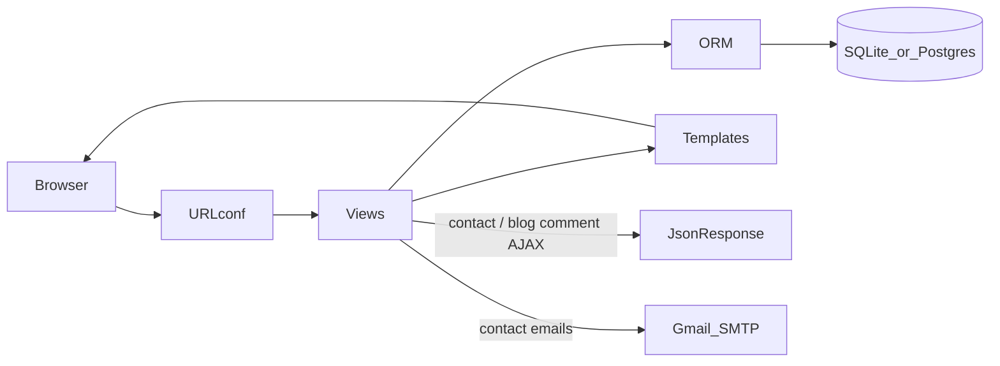
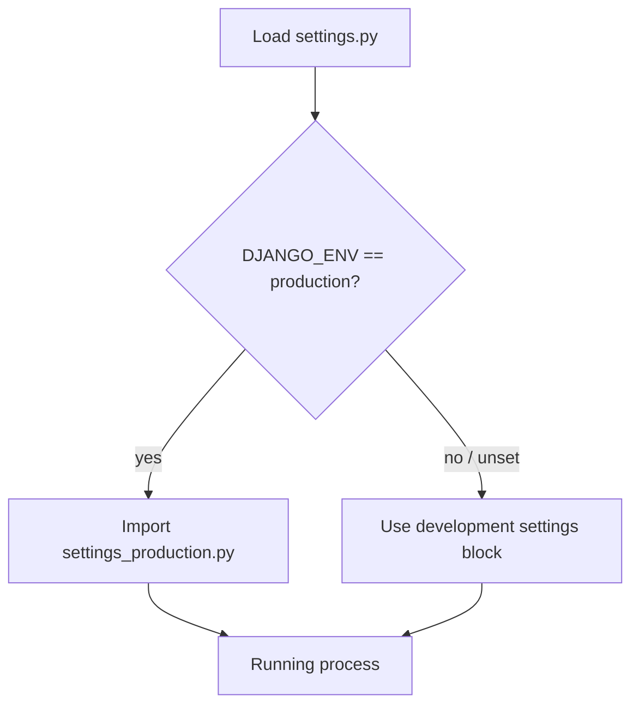
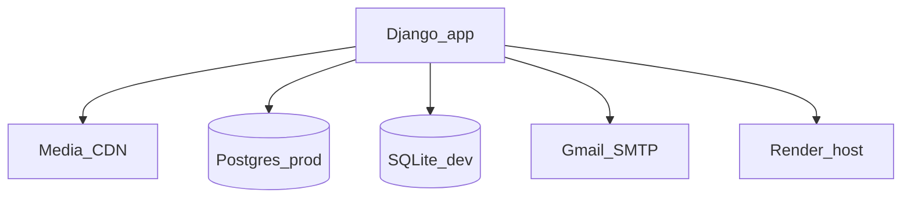

# 03 — Architecture

Nature Holidays is a **single Django monolith** using classic Model–View–Template (MVT). There is no separate frontend build, no SPA, and no public REST/GraphQL API.

## High-level request flow

1. Browser hits a URL defined in [`nature_holidays/urls.py`](../nature_holidays/urls.py) → [`packages/urls.py`](../packages/urls.py).
2. A function or class-based view in [`packages/views.py`](../packages/views.py) runs.
3. The view queries models in [`packages/models.py`](../packages/models.py).
4. Context is passed to a template under [`templates/`](../templates/).
5. HTML (plus static files) is returned.

**Exceptions:** `POST /contact/` and `POST /blog/<slug>/` can return `JsonResponse` for `fetch`-based forms, and contact also sends email via SMTP.

## Layer responsibilities

| Layer | Location | Responsibility |
|-------|----------|----------------|
| URLconf | `nature_holidays/urls.py`, `packages/urls.py` | Routing, named URLs |
| Views | `packages/views.py` | Querysets, filters, form handling, email |
| Models | `packages/models.py` | Schema, relationships, price helpers |
| Templates | `templates/` | HTML presentation |
| Admin | `packages/admin.py` | CMS for staff |
| Settings | `settings.py` / `settings_production.py` | Env-specific config |
| Static | `static/` | CSS, JS, images, fonts |
| Templatetags | `packages/templatetags/currency_format.py` | INR formatting |

There is **no** dedicated `services/`, `serializers/`, or API app. Business logic currently lives in views and a few model methods (e.g. `Package.get_offer_price()`).

## Settings switch

[`nature_holidays/settings.py`](../nature_holidays/settings.py) is the entry module (`DJANGO_SETTINGS_MODULE=nature_holidays.settings`).

| Mode | Trigger | Database | Media | Static |
|------|---------|----------|-------|--------|
| Development | `DJANGO_ENV=development` or unset | SQLite | Local `media/` (or Cloudinary if creds set) | `STATICFILES_DIRS` via runserver |
| Production | `DJANGO_ENV=production` | Postgres via `DATABASE_URL` | Cloudinary required | WhiteNoise + `collectstatic` |

Production settings live in [`settings_production.py`](../nature_holidays/settings_production.py) and include HTTPS/HSTS, secure cookies, logging, and WhiteNoise middleware.

Details: [07-configuration.md](07-configuration.md).

## Authentication and authorization

| Surface | Auth |
|---------|------|
| Public site | No login. Anyone can browse and submit contact/comments. |
| `/admin/` | Django auth (staff / superuser). Unfold skins the admin UI. |
| CSRF | Standard `CsrfViewMiddleware`; AJAX posts send `X-CSRFToken`. |

There are no `@login_required` public views, roles beyond Django staff, or JWT/OAuth.

## Process entry points

| Context | Entry |
|---------|--------|
| Local | `python manage.py runserver` |
| Production | `gunicorn nature_holidays.wsgi:application` |
| ASGI | `asgi.py` exists; Render uses WSGI |
| Build | [`build.sh`](../build.sh) — install, collectstatic, migrate, optional superuser |

## AJAX / JSON surface (not a full API)

Only two interaction patterns return JSON:

| Endpoint | Method | Purpose |
|----------|--------|---------|
| `/contact/` | POST | Save `Contact`, send emails, return `{success: true/false}` |
| `/blog/<slug>/` | POST | Create `BlogComment`, return success/error JSON |

Page loads remain full HTML GETs. Do not document or treat this as a versioned public API.

## Integrations (current)

- **Cloudinary** — uploaded images in production
- **Gmail SMTP** — contact notification + confirmation
- **Google Maps** — static embed iframe on contact page (no Maps API key)
- **WhatsApp / social** — share and profile links in templates
- **Instagram** — manual `InstagramPost` uploads, not the Instagram Graph API

## Known architectural gap

`search_packages` in `views.py` renders `packages/search_results.html`, which is missing from the repository. Prefer `/packages/?q=...` for search until that template is added.

## Design implications for new work

- Prefer extending MVT (new models, views, templates, admin) for site features.
- Introduce DRF / a SPA only when a separate client (mobile app, headless CMS consumer) is a hard requirement — see [09-scaling-guide.md](09-scaling-guide.md).
- Keep secrets in env vars; never hardcode credentials in settings committed to git.
