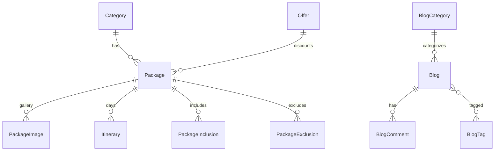

# 04 — Domain model

All domain entities live in [`packages/models.py`](../packages/models.py). There is one Django app (`packages`) owning the entire schema.

## Entity relationship overview



Standalone content models (no FK to Package/Blog): `TeamMember`, `SiteStats`, `NewsletterSubscription`, `CTASection`, `Contact`, `InstagramPost`.

## Package domain

### `Category`

Travel package categories (e.g. Kerala, Beach Holidays). Fields: `name`, `description`, `cover_image`, `is_active`, timestamps.

### `Offer`

Discount definitions. `discount_percentage`, validity window (`valid_from` / `valid_to`), optional seasonal metadata (`is_seasonal`, `season_name`). Linked optionally from `Package`.

### `Package` (core product)

| Field / concept | Notes |
|-----------------|--------|
| `category` | FK → `Category` (CASCADE) |
| `offer` | Optional FK → `Offer` |
| `package_type` | `family`, `group`, `fit`, `honeymoon`, `luxury` |
| `price` | Base price (`Decimal`) |
| `duration`, `location`, `destinations` | Display / search fields |
| `max_group_size`, `min_age` | Optional capacity rules |
| `cover_image` | Primary image |
| `is_featured` | Homepage hero (limited to a few) |
| `is_popular` | Homepage destinations grid |
| `is_active` | Soft visibility flag |

**Helpers:**

- `get_offer_price()` — applies `offer.discount_percentage` when an offer is set; otherwise returns base `price`.
- `get_offer_percentage()` — discount percent or `0`.

### Related package rows

| Model | `related_name` | Role |
|-------|----------------|------|
| `PackageImage` | default `packageimage_set` | Gallery images |
| `Itinerary` | `itineraries` | Day-by-day plan; unique `(package, day_number)` |
| `PackageInclusion` | `inclusions` | What’s included; `order`, `is_highlighted`, icon class |
| `PackageExclusion` | `exclusions` | What’s excluded; ordered |

## Blog domain

| Model | Role |
|-------|------|
| `BlogCategory` | Categories with unique `slug` |
| `BlogTag` | Tags with unique `slug` |
| `Blog` | Post: title, slug, excerpt, content, image, author, `status` (`draft`/`published`), `is_featured`, `views_count` |
| `BlogComment` | Public comments (`name`, `email`, `comment`, `is_active`) |

`Blog.get_absolute_url()` returns `/blog/<slug>/`.

## Site content and leads

| Model | Role | Public wiring |
|-------|------|----------------|
| `TeamMember` | About / home team cards | Used in `home` and `about` views |
| `SiteStats` | Counters (tours, clients, years, destinations, etc.) | `SiteStats.objects.first()` on home |
| `InstagramPost` | Homepage Instagram-style slider images + links | Filtered `is_active`, ordered by `order` |
| `Contact` | Contact form submissions; `is_read` / `is_replied` for admin triage | Created by `contact` view |
| `NewsletterSubscription` | Email list (`email` unique) | **Admin-only today** — no public subscribe view |
| `CTASection` | CTA copy, button, background image | **Admin-managed**; not clearly driven by main public views |

## Soft flags pattern

Most content models use `is_active` (and sometimes `is_featured` / `is_popular`) instead of hard deletes. Public querysets almost always filter `is_active=True` (and blogs filter published status where applicable).

## Which models power which pages

| Page | Primary models |
|------|----------------|
| Home (`/`) | `Package` (featured/popular), `Category`, `Offer`, `TeamMember`, `SiteStats`, `InstagramPost` |
| Package list (`/packages/`) | `Package`, `Category` (+ query filters) |
| Package detail (`/package/<pk>/`) | `Package`, images, itineraries, inclusions, exclusions, related offers |
| About (`/about/`) | `TeamMember` |
| Contact (`/contact/`) | Creates `Contact` |
| Blog list (`/blog/`) | `Blog`, `BlogCategory`, `BlogTag` |
| Blog detail (`/blog/<slug>/`) | `Blog`, `BlogComment` |
| Admin | All registered models |

## Migrations

Migrations live under `packages/migrations/` (initial through later additions such as `InstagramPost`). Always create migrations after model changes:

```bash
python manage.py makemigrations
python manage.py migrate
```

## Design notes for future schema changes

- Prefer new related models under `Package` / `Blog` rather than stuffing large JSON into existing text fields.
- If bookings are added, introduce a new `Booking` (or similar) model with explicit status fields — do not overload `Contact`.
- Before splitting `models.py` into modules, see the conventions in [09-scaling-guide.md](09-scaling-guide.md).
