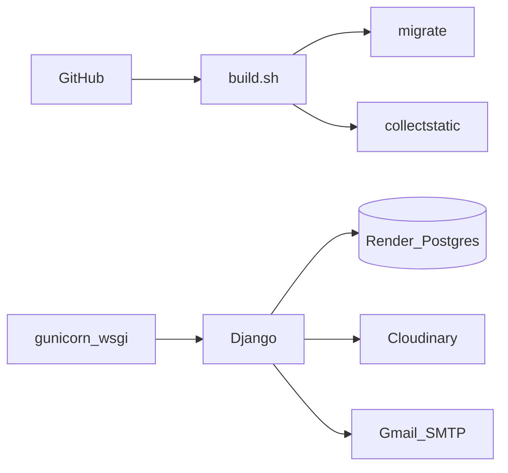

# 08 — Deployment

Production hosting is **Render** (Web Service + PostgreSQL). The app runs under **Gunicorn** with **WhiteNoise** for static files and **Cloudinary** for media.

There is no Docker image or GitHub Actions CI in the repo today.

## Architecture on Render



## Prerequisites

- GitHub repo connected to Render
- Render PostgreSQL instance → `DATABASE_URL`
- Cloudinary account → cloud name, API key, secret
- Gmail account with 2FA + **App Password** for SMTP

## Build and start commands

| Setting | Value |
|---------|--------|
| Runtime | Python 3 (`runtime.txt` → 3.12.8) |
| Build | `./build.sh` |
| Start | `gunicorn nature_holidays.wsgi:application` |

Ensure `build.sh` is executable in git (`chmod +x build.sh` on Unix before commit).

### What [`build.sh`](../build.sh) does

1. `pip install -r requirements.txt`
2. `python manage.py collectstatic --no-input`
3. `python manage.py migrate`
4. Optionally create/update a superuser if `DJANGO_SUPERUSER_*` are all set

## Required environment variables (Render)

```text
DJANGO_ENV=production
SECRET_KEY=<strong-unique-secret>
DEBUG=False
DATABASE_URL=<render-postgres-url>
CLOUDINARY_CLOUD_NAME=...
CLOUDINARY_API_KEY=...
CLOUDINARY_API_SECRET=...
EMAIL_HOST=smtp.gmail.com
EMAIL_PORT=587
EMAIL_USE_TLS=True
EMAIL_HOST_USER=<gmail>
EMAIL_HOST_PASSWORD=<gmail-app-password>
DEFAULT_FROM_EMAIL=Nature Holidays <info@natureholidays.com>
ADMIN_EMAIL=<ops-inbox>
ALLOWED_HOSTS=<your-service.onrender.com>,<custom-domain>
CSRF_TRUSTED_ORIGINS=https://<your-service.onrender.com>,https://<custom-domain>
RENDER_EXTERNAL_HOSTNAME=<your-service.onrender.com>
```

Optional:

```text
DJANGO_SUPERUSER_USERNAME=admin
DJANGO_SUPERUSER_EMAIL=admin@example.com
DJANGO_SUPERUSER_PASSWORD=<strong-password>
```

Full meanings: [07-configuration.md](07-configuration.md).

## Setup steps (summary)

1. Create Render **PostgreSQL**; copy Internal/External Database URL into `DATABASE_URL`.
2. Create Render **Web Service** from the GitHub repo; set build/start commands above.
3. Add all env vars; set `DJANGO_ENV=production`.
4. Configure Cloudinary and Gmail app password.
5. Deploy; watch build logs for migrate/collectstatic errors.
6. Log into `/admin/` and create real content (or run sample data only on non-production if appropriate).

## Post-deploy smoke tests

| Check | Expected |
|-------|----------|
| `/` | Homepage loads; static CSS/JS present |
| `/packages/` | List renders; images from Cloudinary |
| `/package/<id>/` | Detail with itinerary/inclusions |
| `/blog/` | Published posts appear |
| `/contact/` | POST creates Contact in admin; emails arrive if SMTP OK |
| `/admin/` | Staff login works |
| HTTPS | Site forces HTTPS; no mixed-content warnings |

## Free-tier caveats (Render)

- Web service may sleep after inactivity (cold starts).
- Build time and DB size limits apply on free plans.
- Prefer keeping `DEBUG=False` even while debugging; use logs instead.

## Troubleshooting

| Symptom | Likely cause |
|---------|--------------|
| Build fails on migrate | Bad `DATABASE_URL` or DB not ready |
| CSS missing | `collectstatic` failed or WhiteNoise misconfigured |
| Images 404 | Cloudinary env vars missing/wrong |
| CSRF failures | `CSRF_TRUSTED_ORIGINS` missing `https://` origin |
| DisallowedHost | `ALLOWED_HOSTS` / `RENDER_EXTERNAL_HOSTNAME` incomplete |
| Email silent failure | Wrong app password; check contact JSON `email_error` and server logs |

## Related docs

- Local setup: [02-getting-started.md](02-getting-started.md)
- Env reference: [07-configuration.md](07-configuration.md)
- Future ops (Docker/CI): [09-scaling-guide.md](09-scaling-guide.md)
